## 📸 Project Screenshots

### 🧩 Database Relationships

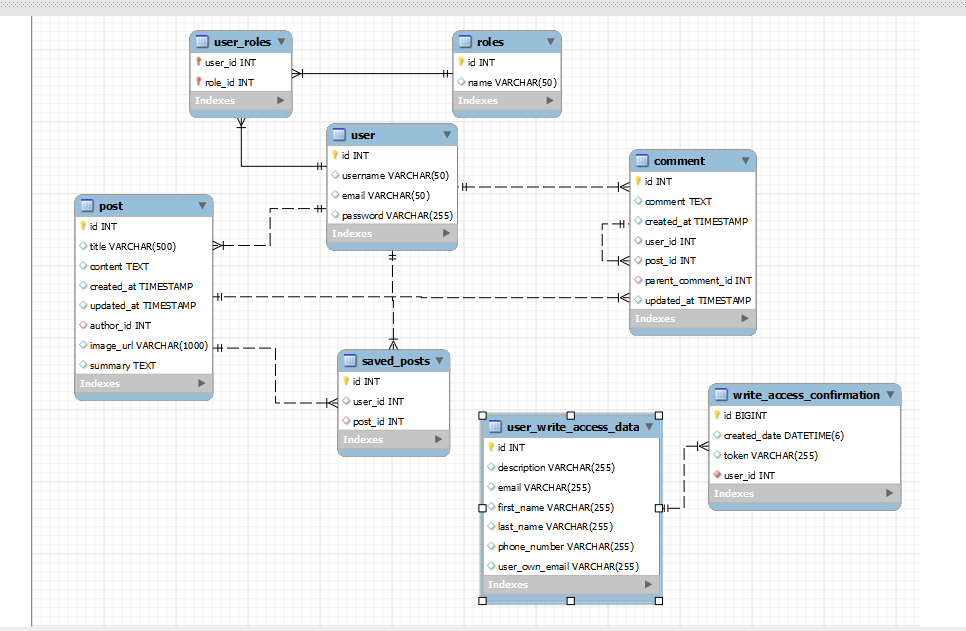  
Core database schema showing relationships between users, posts, comments, roles, and saved posts. This forms the foundation of the blog system.

---

### 🏠 Homepage

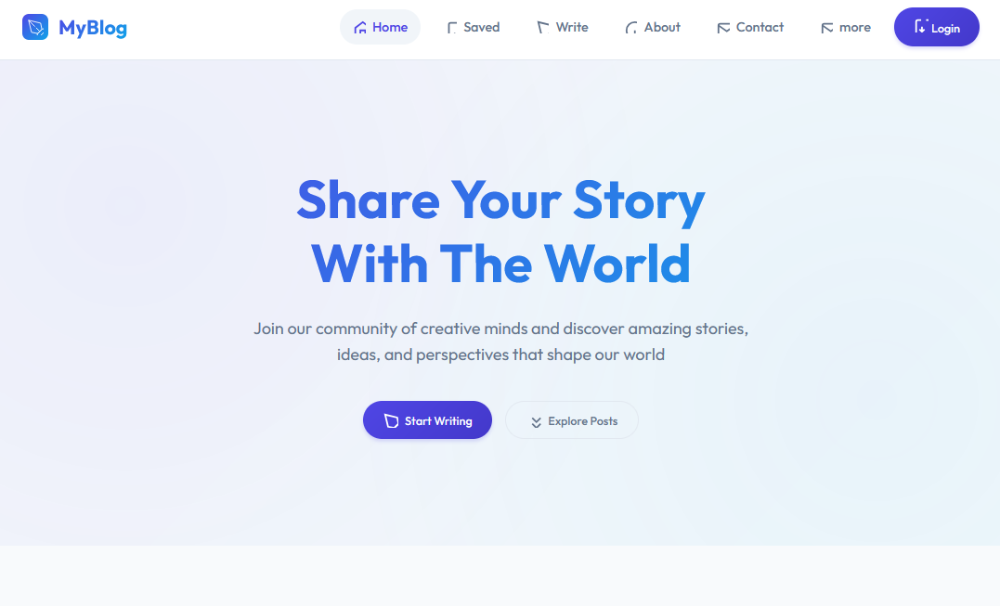  
The landing page where users can see a feed of published blog posts.

---

### 🔐 Login Page

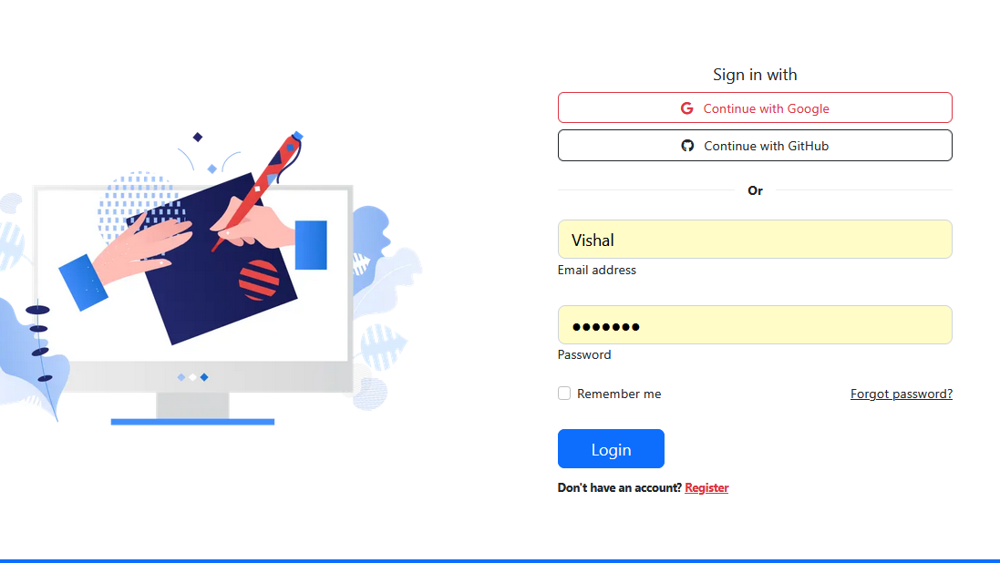  
Login interface for existing users to access their accounts.

---

### 📝 Signup Page

  
Registration page for new users to create an account and request writing permissions.

---

### 🧾 Email Template

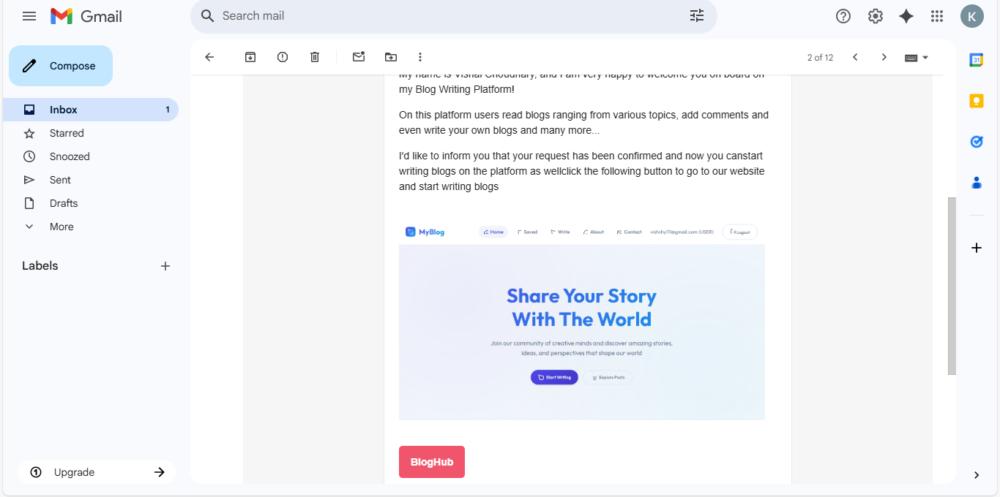  
Email template used for welcoming users and granting blog writing access via a microservice.

---

### 🧑‍💻 Admin Dashboard

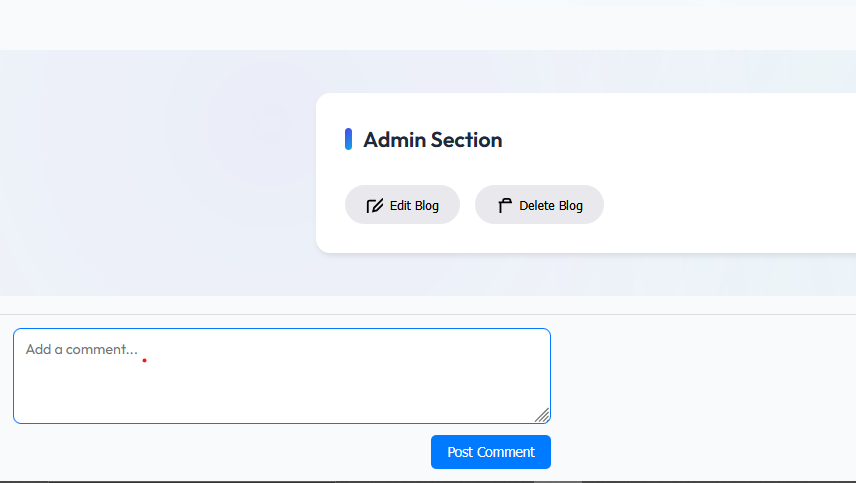  
Admin interface to manage user roles and revoke blog writing permissions.

---

### 🛑 Access Denied

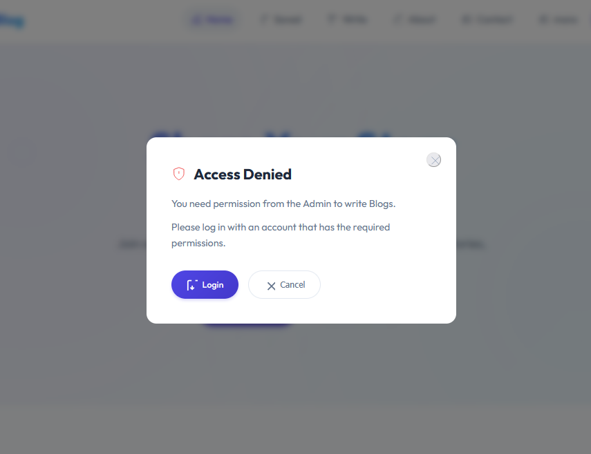  
Shown when users try to access restricted routes or features without proper roles.

---

### 📧 Verify Email

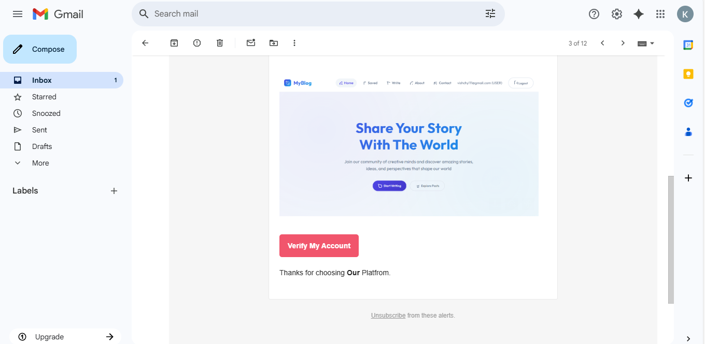  
Page shown after registration to prompt email verification before activation.

---

### 🔓 Permission Request

  
Contact admin page to request blog-writing access. Still needs styling improvements.

---

### ✍️ Create Post

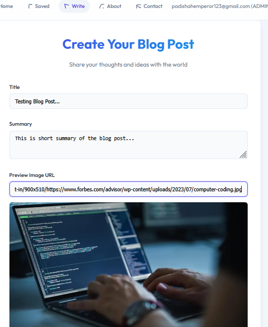  
Interface to write and publish a blog post. Includes a rich text editor.

---

### ✍️ Create Post (Alt View)

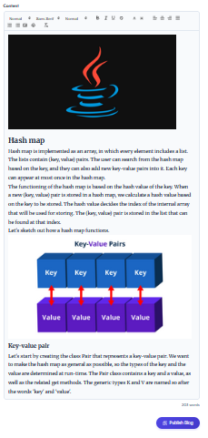  
Alternate view/layout of the blog writing page.

---

### 📥 Saved Posts

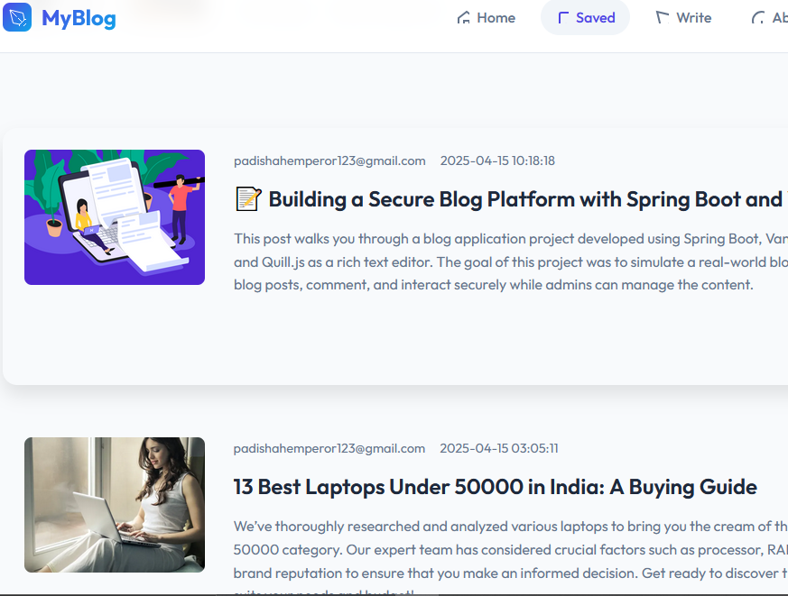  
Page where users can view blog posts they've saved for later reading.

---

### 📰 New Posts

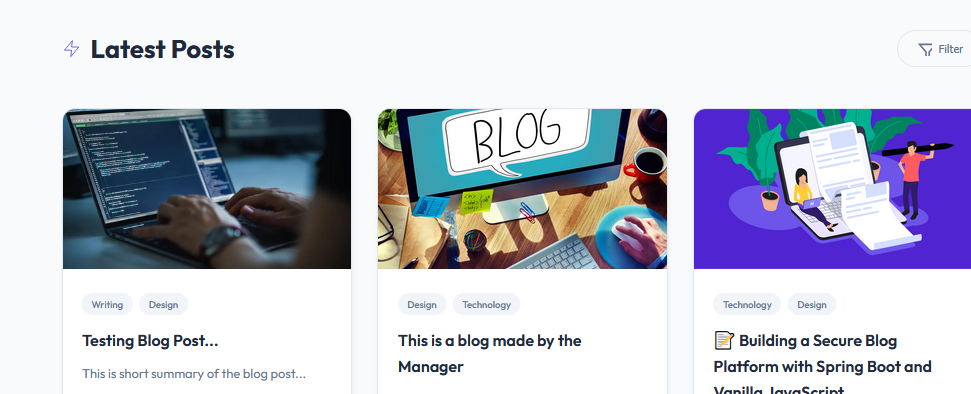  
Section listing the most recently published blog posts.

---

### 📃 All Posts

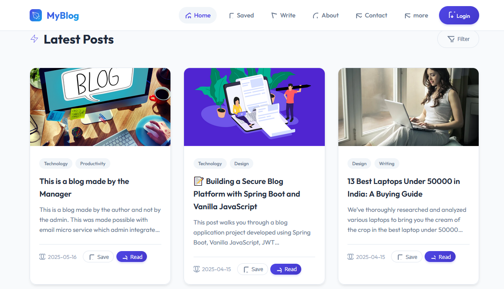  
Main blog index showing all posts from various users.

---

### 📃 All Posts (Alt View)

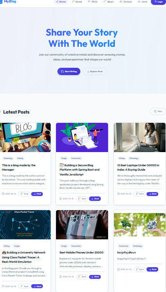  
Alternate layout of the blog list view.

---

### 📬 Posted Confirmation

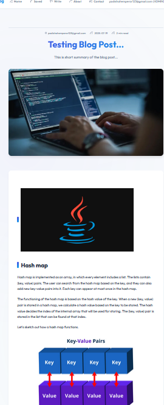  
Confirmation screen shown after a successful blog submission.

---

### 💬 Comment System

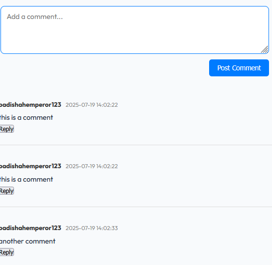  
Commenting interface available under each blog post.

---

### 📖 Open Post View

  
Detailed view of a blog post with options to like, comment, or save.

---

### 📖 Open Post View (Alt)

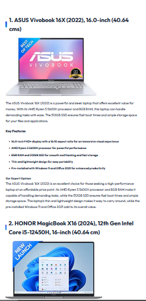  
Alternate layout of the single blog post view.

---

### ✍️ User Write Access

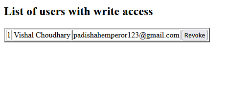  
Interface showing that the user has blog writing privileges.

---

> ⚠️ **Note:** Some pages like the comment system, admin contact page for permission requests, and revoke permissions interface still need to be styled properly. CSS was assisted with AI tools, which may have introduced unused styles that are yet to be cleaned up.
> Some CSS in this project was generated using AI tools to speed things up. That means there's a bit of messy or unused code still hanging around — I'm planning to clean it up soon. Also, pages like the comment system and admin permission request/revoke screens still need proper styling.

But most of the Javascript was written by me
Java Spring/Spring Boot code was almost entirely written by me
